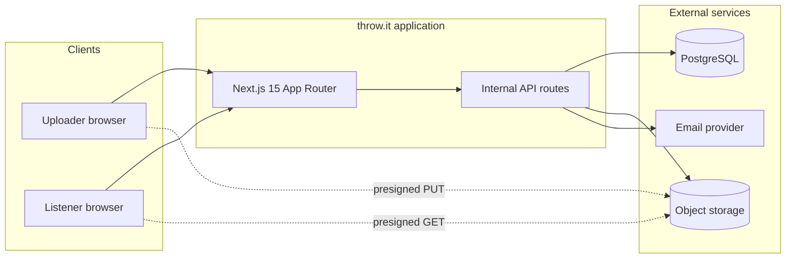
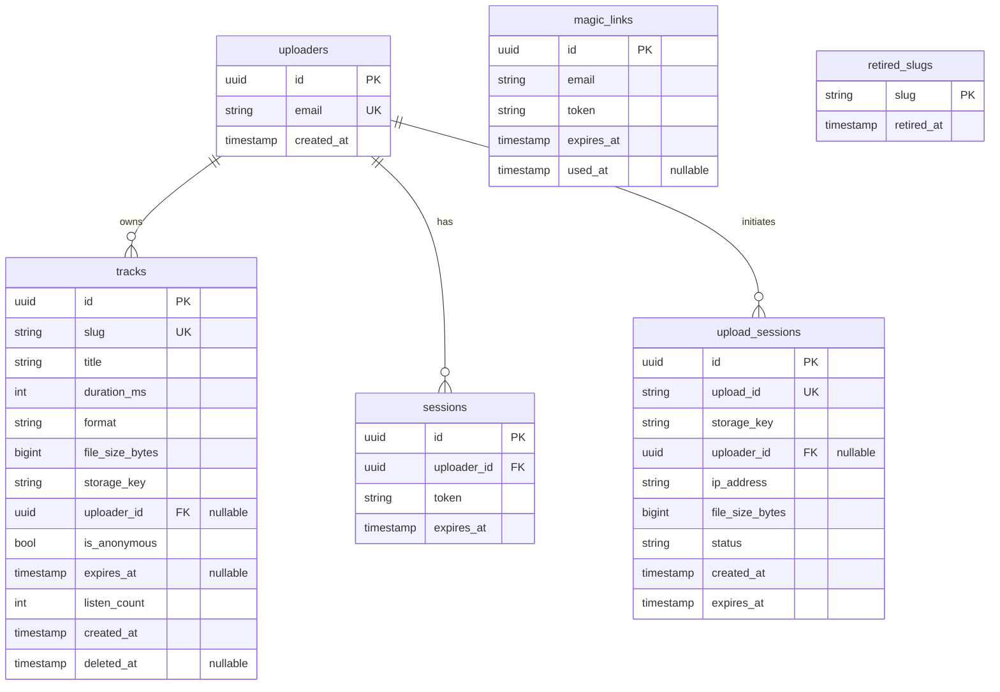
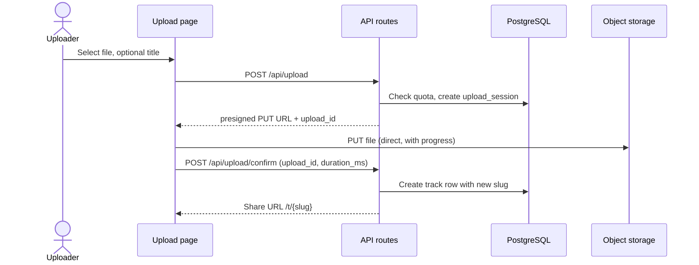
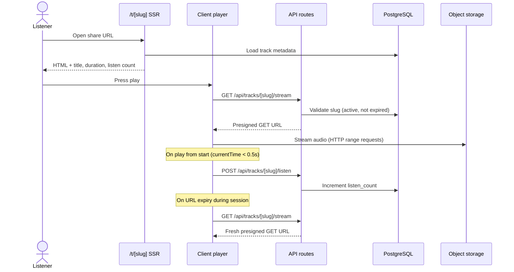
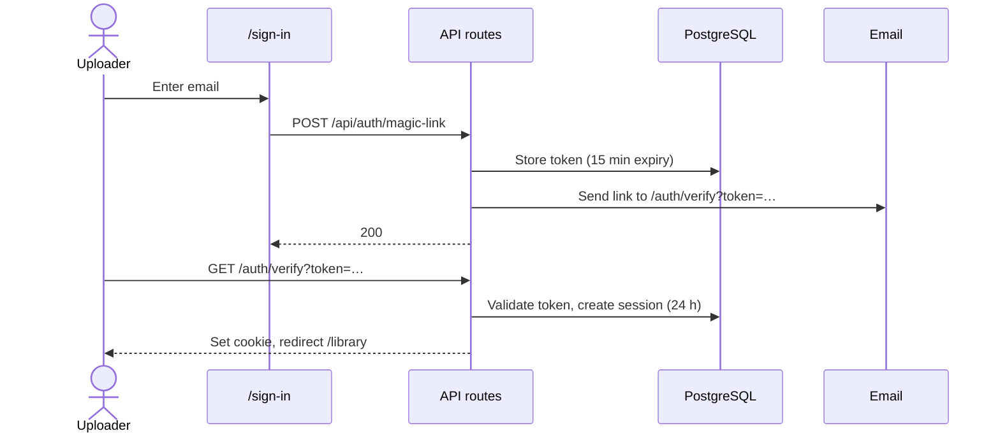
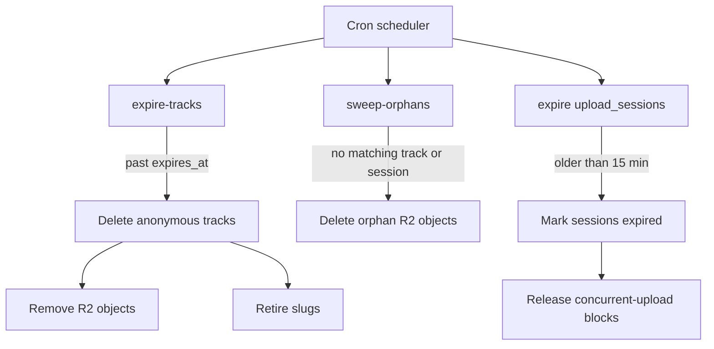

# throw.it — technical architecture

Architect-facing overview of how the MVP works at runtime. For product scope, UX, and decision rationale, see `proposal.md` and `design.md`. For behavioral requirements, see `specs/`.

---

## 1. Purpose

throw.it is a link-sharing platform for audio professionals. Uploaders publish a track and receive a short URL; listeners open that URL and stream in the browser without an account.

The system supports two upload modes that share the same playback path. Signed-in uploaders get persistent storage and a library. Anonymous uploaders get a 10-minute temporary track with IP-based quotas.

Audio bytes never pass through the application server. Metadata lives in PostgreSQL; files live in S3-compatible object storage (Cloudflare R2 in production, MinIO locally).

---

## 2. System context

The application is a single deployable unit: one Next.js monorepo serving pages (SSR) and internal `/api/*` routes. There is no public third-party API; all endpoints exist to support the web UI.

Listeners never authenticate. Uploaders authenticate only when using persistent upload or library features.

---

## 3. Runtime components

| Component | Role |
|-----------|------|
| **Next.js pages** | SSR for playback metadata and Open Graph; Server Components for library reads |
| **Client components** | Upload flow, audio player, forms, dialogs, clipboard actions |
| **API routes** | Auth, upload orchestration, stream URL issuance, listen increment, track mutations |
| **PostgreSQL** | Uploaders, sessions, tracks, upload sessions, magic links, retired slugs |
| **Object storage** | Audio file blobs keyed by `storage_key`; private bucket, presigned access only |
| **Email** | Magic link delivery (Resend in production, SMTP/Mailpit locally) |
| **Background jobs** | Expire anonymous tracks, sweep orphaned uploads, release abandoned upload sessions |

### Frontend split

Server Components are the default. Client boundaries are limited to interactive surfaces: upload progress, player, auth forms, rename/delete dialogs, and theme toggle.

Reads (library list, playback page metadata) happen in Server Components. Mutations call `/api/*` from the client, then `router.refresh()` where needed.

---

## 4. Data model

Six logical tables. Tracks are the central entity; upload sessions are a short-lived staging state before confirmation.

### Entity rules

**Tracks** — Created only after upload confirmation. `slug` is an 8-character random identifier exposed at `/t/{slug}`. Slugs are retired permanently on delete or anonymous expiry and never reassigned.

**Upload sessions** — Hold in-progress uploads for up to 15 minutes. Quota and concurrent-upload limits apply to active sessions. Orphaned storage keys without a matching track are removed by the sweeper job.

**Anonymous tracks** — `uploader_id` is null, `is_anonymous` is true, `expires_at` is set to 10 minutes after confirm. IP address is captured for quota enforcement.

**Soft delete** — Signed-in track deletion sets `deleted_at`; the playback page returns 404. The R2 object is removed and the slug is retired.

---

## 5. API surface

All routes are internal to the application. Authentication uses an HTTP-only session cookie resolved server-side.

| Method | Route | Auth | Purpose |
|--------|-------|------|---------|
| `POST` | `/api/auth/magic-link` | — | Issue magic link email |
| `GET` | `/auth/verify` | — | Validate token, create session, redirect to `/library` |
| `POST` | `/api/upload` | Session | Start signed-in upload; return presigned PUT + `upload_id` |
| `POST` | `/api/upload/temp` | — | Start anonymous upload; return presigned PUT + `upload_id` |
| `POST` | `/api/upload/confirm` | Session or IP | Promote upload session to track; return share URL |
| `GET` | `/api/tracks/[slug]/stream` | — | Issue presigned GET URL (refresh on demand) |
| `POST` | `/api/tracks/[slug]/listen` | — | Increment `listen_count` |
| `PATCH` | `/api/tracks/[id]` | Session | Rename track (ownership check) |
| `DELETE` | `/api/tracks/[id]` | Session | Soft-delete track, remove R2 object, retire slug |

Sign-out is a route handler that deletes the session row and clears the cookie.

### Quota enforcement (upload initiation)

| Mode | Limits checked at `POST /api/upload` or `/api/upload/temp` |
|------|-------------------------------------------------------------|
| Signed-in | 500 MB per file; 5 GB total per uploader; one in-progress upload session |
| Anonymous | 3 active tracks per IP; 100 MB combined per IP; one in-progress upload session |

Confirmed tracks count toward quota. In-progress upload sessions block further uploads for 15 minutes.

---

## 6. Core flows

### 6.1 Signed-in upload

The client uploads directly to R2 via XMLHttpRequest. Duration is reported by the browser at confirm time; no server-side audio probing.

Confirm is idempotent per `upload_id` (same-ticket retry without re-uploading the file).

### 6.2 Anonymous upload

The flow matches signed-in upload except initiation hits `POST /api/upload/temp` without a session. Confirm sets `expires_at` to 10 minutes from confirmation and derives the title from the filename.

Signed-in users visiting `/upload/temp` are redirected to `/upload`.

### 6.3 Playback and streaming

Playback metadata is server-rendered for fast first paint and Open Graph tags. The audio element streams from R2, not through the app server.

Presigned URL TTL is 1–4 hours for signed-in tracks. For anonymous tracks, the URL is capped at `expires_at`.

### 6.4 Magic link authentication

Magic links are reusable within the 15-minute window until first successful sign-in. Sessions last 24 hours and allow multiple devices.

---

## 7. Background jobs

Three cleanup responsibilities run on a schedule (Vercel cron in production, CLI scripts locally).

| Job | Trigger | Effect |
|-----|---------|--------|
| **expire-tracks** | Tracks past `expires_at` | Delete row, remove R2 object, retire slug, free IP quota |
| **sweep-orphans** | R2 keys without track or active session | Delete orphan objects |
| **expire upload_sessions** | Sessions older than 15 minutes | Mark expired; unblock uploader/IP for new uploads |

Signed-in track deletion is synchronous in the `DELETE` API route (not deferred to cron).

---

## 8. Architectural constraints

These boundaries shape every design choice in the MVP.

| Constraint | Implication |
|------------|-------------|
| No transcoding | Browser-native decode only; format warnings at upload, errors at playback |
| No CDN | Single-region R2; acceptable latency at early scale |
| No public API | All integration is through the web UI |
| Private bucket | All file access via short-lived presigned URLs |
| Serverless app host | Large files bypass the app server; no server-side duration probing |
| $0 MVP budget | Free tiers for compute, database, storage, and email |

For full decision rationale and rejected alternatives, see `design.md` § Decisions. For per-capability requirements, see `specs/*/spec.md`.
