# throw.it — endpoint handlers

Handler-facing reference for every internal route: validation order, persistence, side effects, and error paths. For system context, data model, and cross-cutting flows, see `architecture.md`. For behavioral requirements, see `specs/*/spec.md`.

---

## 1. Purpose

All routes exist to support the web UI. There is no public third-party API. Audio bytes never pass through these handlers; they orchestrate metadata, issue presigned URLs, and call external services.

This document is the detailed design layer between the route inventory in `architecture.md` §5 and implementation code. Each section follows the same shape: auth, input, numbered handler steps, response, and errors.

---

## 2. Shared conventions

### Authentication

Signed-in routes resolve the uploader from an HTTP-only session cookie. The handler loads the matching `sessions` row, checks `expires_at`, and joins to `uploaders`. Missing, expired, or invalid sessions are treated as unauthenticated.

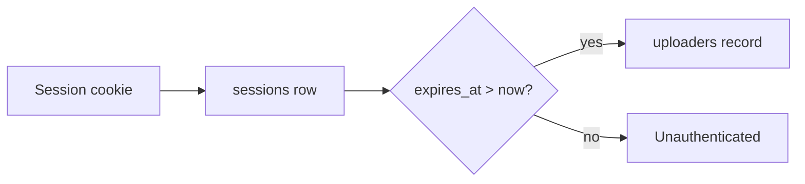

### Client IP (anonymous routes)

Anonymous quota checks use the client IP from `X-Forwarded-For` on Vercel. Local dev falls back to a connection IP or dev-safe header. The IP is stored on `upload_sessions` at initiation and on anonymous `tracks` at confirm.

### Supported formats

Upload initiation validates extension and MIME type against MP3, WAV, FLAC, AAC, and OGG. Unsupported formats return **400** before any storage is allocated.

### Upload session lifecycle

`upload_sessions` are created at initiation and promoted at confirm. Status progresses `pending` → `confirmed` or `expired`. Sessions older than 15 minutes are marked expired by a background job and no longer block concurrent uploads.

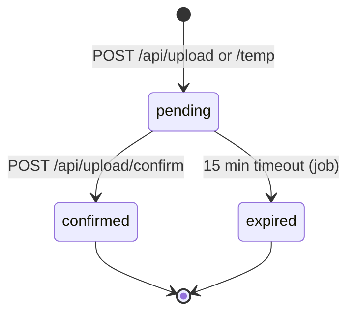

### Slug allocation

New tracks receive an 8-character random slug from a 62-character alphabet. The handler retries on collision against both `tracks.slug` and `retired_slugs`. Slugs are retired permanently on delete or anonymous expiry.

### Error responses

Handlers return JSON `{ error: string }` with an appropriate HTTP status unless the route performs a redirect. Messages are user-facing; the UI maps known errors to dedicated states (quota, IP limits, format, and so on).

| Status | When |
|--------|------|
| **400** | Invalid input, unsupported format, oversize file |
| **401** | Session required but missing or expired |
| **403** | Authenticated but not the resource owner |
| **404** | Track, slug, or upload session not found (or inactive) |
| **409** | Concurrent upload in progress |
| **413** | Storage quota exceeded (signed-in 5 GB or anonymous 100 MB IP cap) |
| **429** | Anonymous IP track limit (3 active tracks) |
| **500** | Unexpected failure (email send, storage, database) |

---

## 3. Authentication

### 3.1 `POST /api/auth/magic-link`

Issues a magic link email. No authentication required.

**Input:** `{ email: string }`

**Handler steps**

1. Validate email format; reject malformed addresses with **400**.
2. Generate a cryptographically random token; insert a `magic_links` row with 15-minute `expires_at`.
3. Upsert is not required — multiple outstanding links for the same email are allowed within the window.
4. Send email containing `{APP_URL}/auth/verify?token={token}` via the email helper.
5. Return **200** `{ ok: true }` regardless of whether the email is new (no account enumeration).

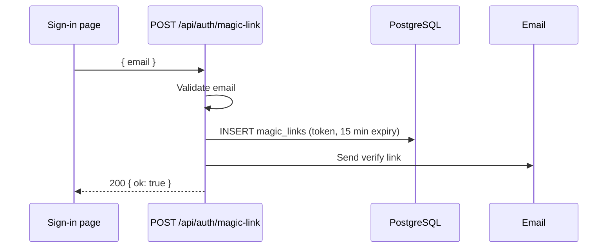

**Errors:** **400** invalid email; **500** email delivery failure.

---

### 3.2 `GET /auth/verify`

Validates a magic link token and establishes a session. No prior authentication required.

**Input:** query `token`

**Handler steps**

1. Load `magic_links` row by token. Missing row → redirect to `/sign-in?error=expired`.
2. Check `expires_at > now()`. Expired → redirect to `/sign-in?error=expired`.
3. Find or create `uploaders` row for the link's email (first sign-in creates the account).
4. Generate session token; insert `sessions` row with 24-hour `expires_at`.
5. Set HTTP-only session cookie on the response.
6. Redirect to `/library`.

Magic links remain valid for reuse within the 15-minute window until first successful sign-in on any device. After sign-in, the same link may still work on another device if still within the window.

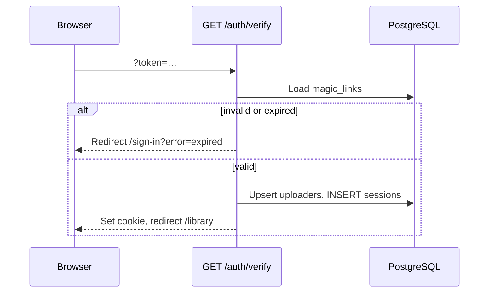

**Errors:** Invalid or expired tokens redirect to the sign-in page; no JSON body.

---

### 3.3 `POST /api/auth/sign-out`

Invalidates the current browser session. Session cookie required (invalid or missing cookie still clears the cookie and redirects).

**Handler steps**

1. Resolve session from cookie; load matching `sessions` row if present.
2. Delete the `sessions` row when found (other devices keep their own sessions).
3. Clear the session cookie regardless of whether a row existed.
4. Redirect to `/`.

**Response:** **302** redirect to `/`.

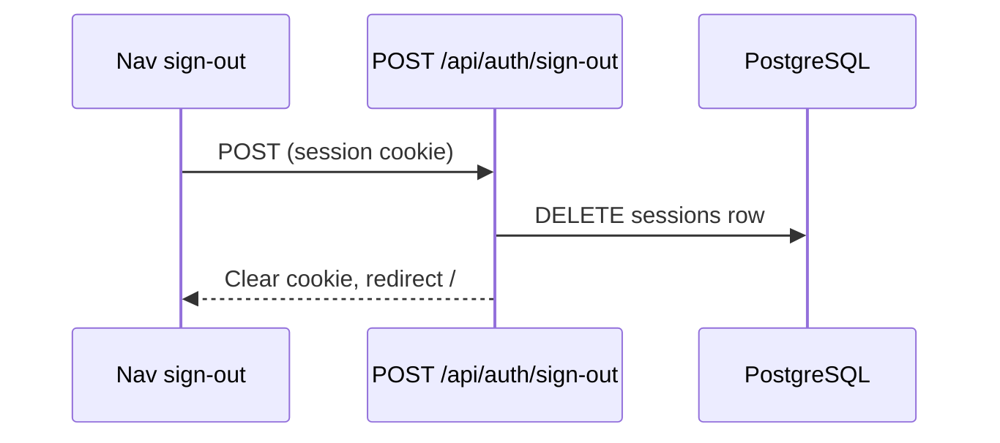

---

## 4. Upload initiation

Both initiation routes share the same downstream confirm path. They differ in auth, quota rules, and what gets stored on the `upload_sessions` row.

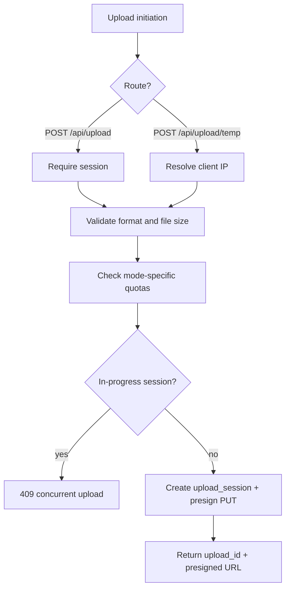

---

### 4.1 `POST /api/upload`

Starts a signed-in upload. Session required.

**Input:** `{ filename: string, fileSizeBytes: number, contentType: string, title?: string }`

The optional `title` is held client-side until confirm; it is not persisted on the upload session.

**Handler steps**

1. Resolve uploader from session. Missing session → **401**.
2. Validate format (extension + MIME) → **400** if unsupported.
3. Validate `fileSizeBytes ≤ 500 MB` → **400** if exceeded.
4. Sum `file_size_bytes` for the uploader's non-deleted tracks. If `used + fileSizeBytes > 5 GB` → **413**.
5. Check for an in-progress `upload_sessions` row for this uploader (`status = pending`, `expires_at > now()`) → **409** if found.
6. Generate `upload_id` (UUID) and `storage_key` (unique object key in R2).
7. Insert `upload_sessions` with `uploader_id`, `ip_address`, `file_size_bytes`, `status = pending`, `expires_at = now() + 15 min`.
8. Generate presigned PUT URL for `storage_key` (client uploads directly to R2).
9. Return **200** `{ uploadId, presignedPutUrl }`.

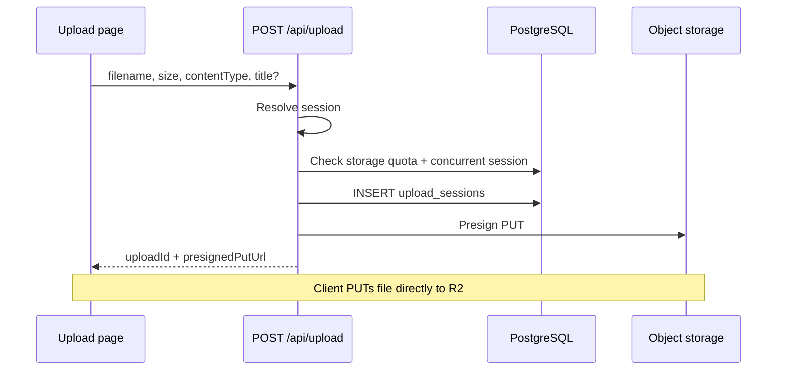

**Errors:** **401**, **400** (format/size), **413** (account cap), **409** (concurrent upload).

---

### 4.2 `POST /api/upload/temp`

Starts an anonymous upload. No session required.

**Input:** `{ filename: string, fileSizeBytes: number, contentType: string }`

No title field — title is derived from filename at confirm.

**Handler steps**

1. Resolve client IP from `X-Forwarded-For`.
2. Validate format → **400** if unsupported.
3. Validate `fileSizeBytes ≤ 500 MB` → **400** if exceeded (same per-file cap as signed-in).
4. Count active anonymous tracks for this IP (`is_anonymous = true`, `expires_at > now()`, not deleted). If count ≥ 3 → **429**.
5. Sum `file_size_bytes` of active anonymous tracks for this IP. If `used + fileSizeBytes > 100 MB` → **413**.
6. Check for in-progress `upload_sessions` for this IP (`status = pending`, `expires_at > now()`) → **409** if found.
7. Generate `upload_id` and `storage_key`.
8. Insert `upload_sessions` with `uploader_id = null`, `ip_address`, `file_size_bytes`, `status = pending`, `expires_at = now() + 15 min`.
9. Generate presigned PUT URL.
10. Return **200** `{ uploadId, presignedPutUrl }`.

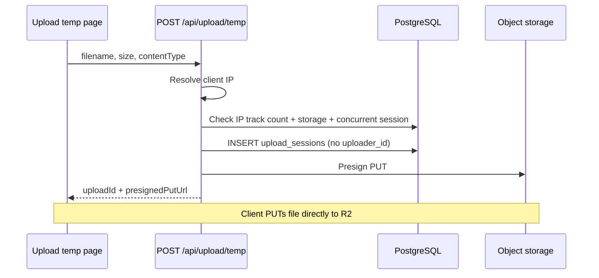

**Errors:** **400**, **413** (IP storage cap), **429** (IP track limit), **409** (concurrent upload).

---

### 4.3 `POST /api/upload/confirm`

Promotes a completed upload session to a track. Called after the client finishes the direct R2 PUT.

**Input:** `{ uploadId: string, durationMs?: number, title?: string }`

For anonymous uploads, `title` is ignored; the handler derives it from the session's original filename.

**Handler steps**

1. Load `upload_sessions` by `upload_id`. Not found → **404**.
2. Check session `status = pending` and `expires_at > now()`. Expired or already confirmed → **404** (idempotent path handles already-confirmed — see step 8).
3. Verify the R2 object exists at `storage_key` (HEAD request). Missing object → **404**.
4. **Signed-in path:** resolve session cookie; confirm `upload_sessions.uploader_id` matches the authenticated uploader → **403** on mismatch; no session when `uploader_id` is set → **401**.
5. **Anonymous path:** when `uploader_id` is null, verify the request IP matches `upload_sessions.ip_address` → **403** on mismatch.
6. Allocate a unique 8-char slug (retry on collision with `tracks` or `retired_slugs`).
7. Insert `tracks` row:
   - Signed-in: `uploader_id` set, `is_anonymous = false`, `expires_at = null`, title from input or filename stem.
   - Anonymous: `uploader_id = null`, `is_anonymous = true`, `expires_at = now() + 10 min`, title from filename stem.
   - Both: `duration_ms` from input (nullable), `format` from file extension, `file_size_bytes`, `storage_key`, `listen_count = 0`.
8. Mark `upload_sessions.status = confirmed`.
9. Return **200** `{ slug, shareUrl: "/t/{slug}" }`.

**Idempotency:** If confirm is retried with the same `upload_id` after a successful confirm, return the existing track's slug and share URL without creating a duplicate row.

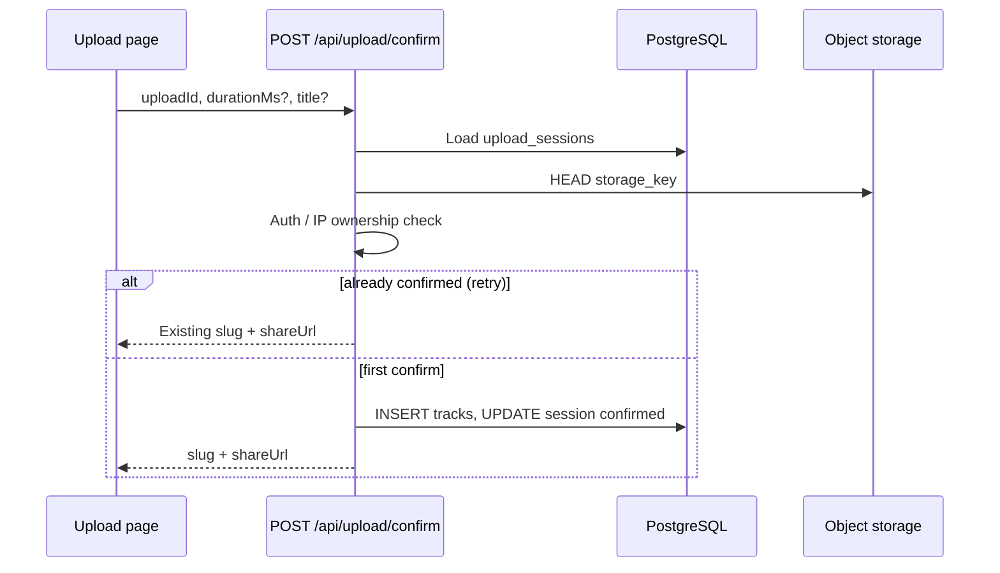

**Errors:** **401**, **403**, **404** (session, object, or expired).

---

## 5. Playback

### 5.1 `GET /api/tracks/[slug]/stream`

Issues a presigned GET URL for in-browser streaming. No authentication required.

**Handler steps**

1. Load track by slug where `deleted_at IS NULL`.
2. Not found → **404**.
3. For anonymous tracks, check `expires_at > now()`. Expired → **404**.
4. Generate presigned GET URL for `storage_key`.
5. Set URL TTL to 1–4 hours for signed-in tracks. For anonymous tracks, cap expiry at the track's `expires_at` (whichever is sooner).
6. Return **200** `{ streamUrl, expiresAt }`.

The player calls this endpoint on play and again when the current URL expires. Audio streams directly from R2 with HTTP range support; the app server does not proxy bytes.

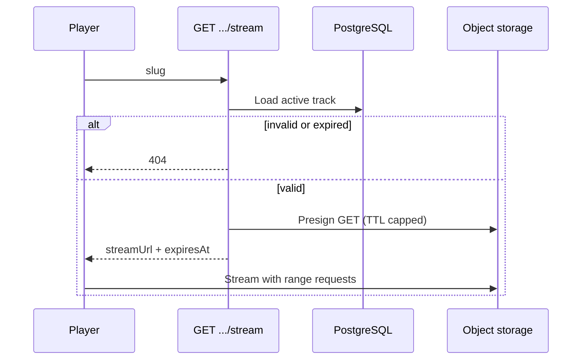

**Errors:** **404** for missing, deleted, or expired tracks.

---

### 5.2 `POST /api/tracks/[slug]/listen`

Atomically increments `listen_count`. No authentication required. The player calls this fire-and-forget on a countable play (see `specs/shareable-playback/spec.md`).

**Handler steps**

1. Load track by slug where `deleted_at IS NULL`.
2. Not found → **404**.
3. For anonymous tracks, check `expires_at > now()`. Expired → **404**.
4. Execute `UPDATE tracks SET listen_count = listen_count + 1 WHERE slug = ?` (atomic increment).
5. Return **200** `{ listenCount }` with the updated value.

Listen counting rules are enforced client-side. The server accepts any call for a valid slug; it does not deduplicate by IP or session in MVP.

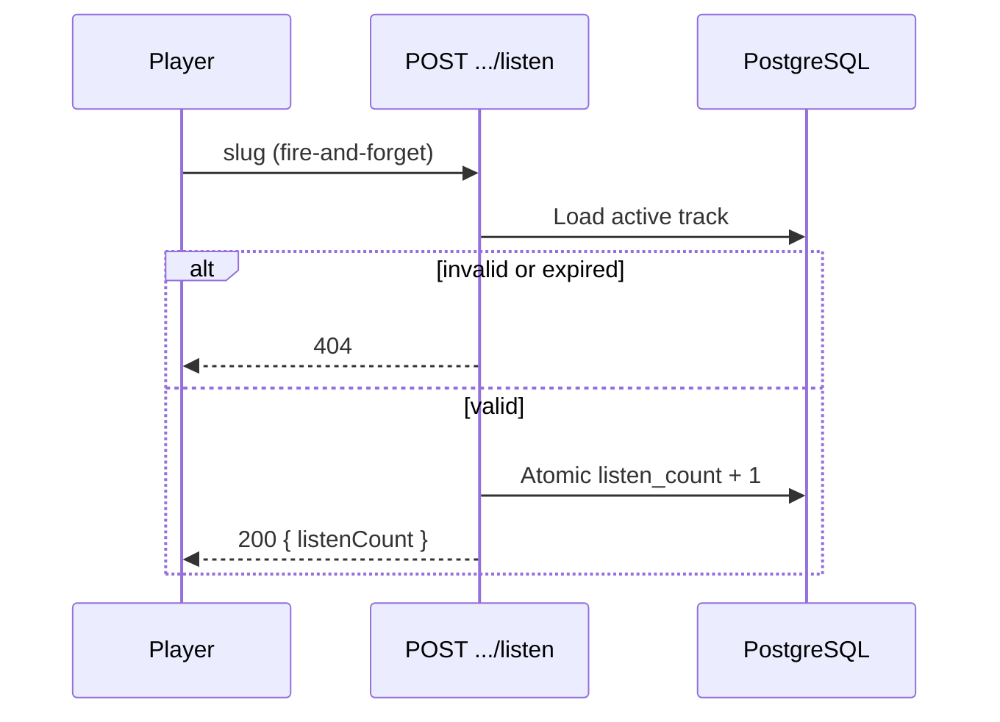

**Errors:** **404** for missing, deleted, or expired tracks.

---

## 6. Track management

Both routes operate on track UUID (`id`), not slug. Session required.

---

### 6.1 `PATCH /api/tracks/[id]`

Renames a signed-in track. Slug is unchanged.

**Input:** `{ title: string }`

**Handler steps**

1. Resolve uploader from session. Missing → **401**.
2. Validate title is non-empty after trim → **400** if blank.
3. Load track by `id` where `deleted_at IS NULL`. Not found → **404**.
4. Check `tracks.uploader_id` matches session uploader → **403** if not owner.
5. Reject anonymous tracks (`is_anonymous = true`) → **403**.
6. Update `title`.
7. Return **200** `{ id, title, slug }`.

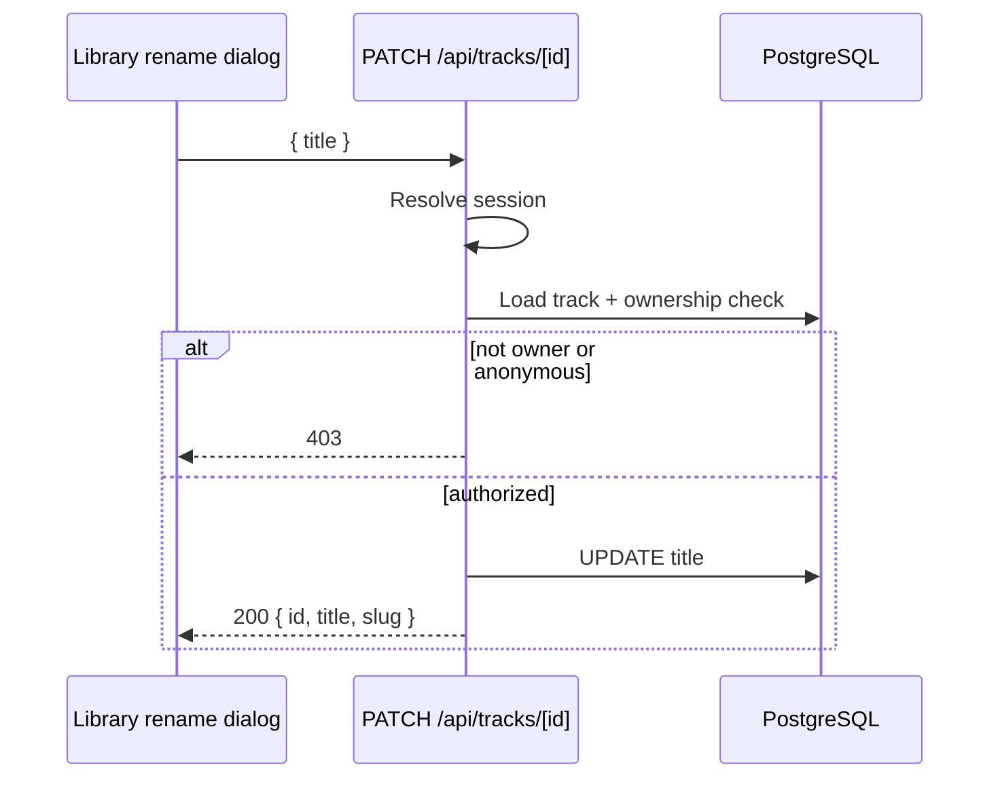

**Errors:** **401**, **400**, **403**, **404**.

---

### 6.2 `DELETE /api/tracks/[id]`

Permanently removes a signed-in track. Synchronous cleanup — not deferred to cron.

**Handler steps**

1. Resolve uploader from session. Missing → **401**.
2. Load track by `id` where `deleted_at IS NULL`. Not found → **404**.
3. Check ownership → **403** if not owner or if anonymous.
4. Set `deleted_at = now()` (soft delete).
5. Delete R2 object at `storage_key`.
6. Insert slug into `retired_slugs`.
7. Return **200** `{ ok: true }`.

After deletion, `/t/{slug}` SSR and stream/listen endpoints return **404**. Storage freed immediately counts toward the uploader's 5 GB cap.

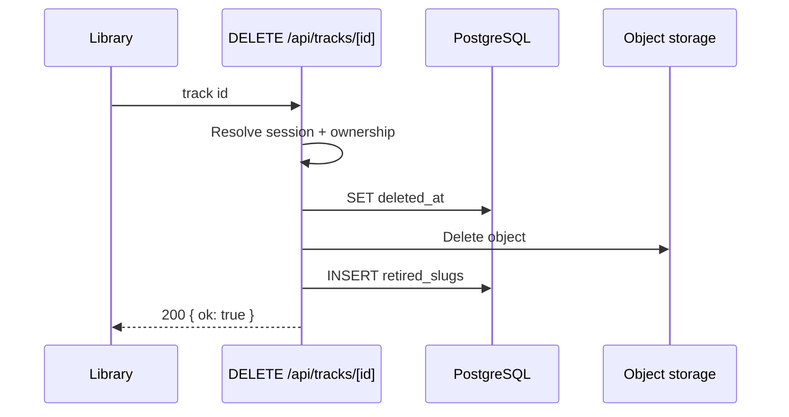

**Errors:** **401**, **403**, **404**.

---

## 7. Route index

Quick reference back to the handler sections above.

| Method | Route | Section | Auth |
|--------|-------|---------|------|
| `POST` | `/api/auth/magic-link` | §3.1 | — |
| `GET` | `/auth/verify` | §3.2 | — |
| `POST` | `/api/auth/sign-out` | §3.3 | Session |
| `POST` | `/api/upload` | §4.1 | Session |
| `POST` | `/api/upload/temp` | §4.2 | — |
| `POST` | `/api/upload/confirm` | §4.3 | Session or IP |
| `GET` | `/api/tracks/[slug]/stream` | §5.1 | — |
| `POST` | `/api/tracks/[slug]/listen` | §5.2 | — |
| `PATCH` | `/api/tracks/[id]` | §6.1 | Session |
| `DELETE` | `/api/tracks/[id]` | §6.2 | Session |

For background jobs that affect upload sessions and anonymous tracks, see `architecture.md` §7.
